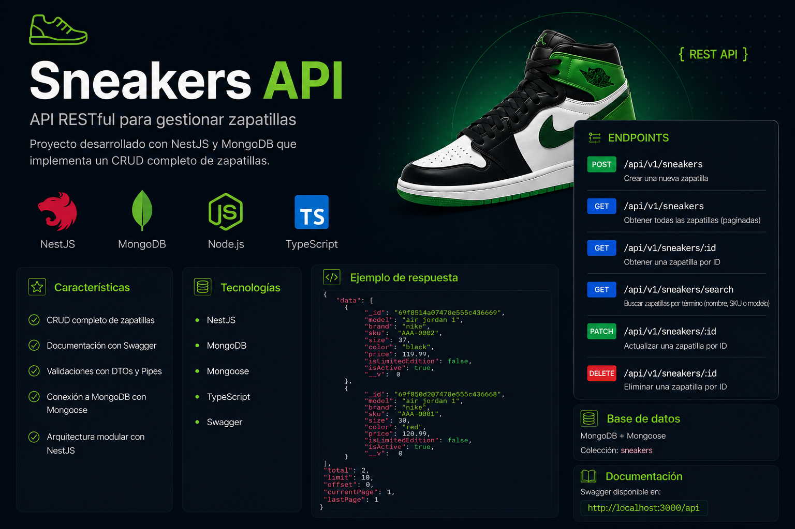

# 👟 Sneakers API



---

## 📋 Descripción

API RESTful desarrollada con **NestJS** y **MongoDB**. El proyecto consiste en un sistema de gestión de zapatillas (Sneakers), permitiendo realizar operaciones CRUD completas y búsquedas avanzadas con paginación.

Está diseñada siguiendo una arquitectura modular y preparada para entornos productivos mediante **Docker**.

---

## ✨ Características (Features)

* ✅ Documentación Interactiva: Implementación completa con Swagger UI.
* ✅ Paginación: Control de flujo de datos en el listado de zapatillas.
* ✅ Validación Estricta: Uso de DTOs y Pipes con class-validator para asegurar la integridad de los datos.
* ✅ Carga de Datos (Seed): Endpoint especializado para poblar la base de datos con información de prueba rápidamente.
* ✅ Contenerización: Configuración lista para Docker y Docker Compose.
* ✅ Seguridad: Validación de variables de entorno y tipado fuerte con TypeScript.

---

## 🛠️ Tecnologías utilizadas

* **Framework:** [NestJS](https://nestjs.com/)
* **Lenguaje:** [TypeScript](https://www.typescriptlang.org/)
* **Base de Datos:** [MongoDB](https://www.mongodb.com/)
* **ODM:** [Mongoose](https://mongoosejs.com/)
* **Contenerización:** [Docker](https://www.docker.com/) & [Docker Compose](https://docs.docker.com/compose/)
* **Documentación:** [Swagger](https://swagger.io/)

---

## 🚀 Instalación y Ejecución

La API está configurada para detectar automáticamente el entorno de ejecución.

### Opción 1: Docker (Entorno de Producción)

Ideal para probar la aplicación completa con un solo comando. Docker inyectará automáticamente la configuración de producción.

1. Clona el repositorio:

```bash
git clone https://github.com/Ryze05/sneakersAPI.git
```

1. Levanta los contenedores:

```bash
docker-compose up --build
```

3. Accede a la documentación en: <http://localhost:3000/api>

### Opción 2: Desarrollo Local

1. Clona el repositorio:

```bash
git clone https://github.com/Ryze05/sneakersAPI.git
```

2. Instala las dependencias:

```bash
npm install
```

3. Levanta solo la base de datos con Docker:

```bash
docker-compose up mongodb -d
```

4. Copia el archivo `.env.template` a `.env` y arranca la app:

```bash
npm run start:dev
```

---

## ⚙️ Gestión de Entornos

El proyecto utiliza una estrategia de **Multi-Environment Config** gestionada por NestJS y Docker:

* **Desarrollo (`.env`):** Configurado para conectar a `localhost`. Se activa automáticamente al correr en local.
* **Producción (`.env.prod`):** Configurado para la red interna de Docker. Se activa mediante la variable de sistema `NODE_ENV=prod` definida en el `Dockerfile`.

Esta separación permite que el mismo código sea desplegable en cualquier infraestructura sin cambios manuales.

---

## 📖 Documentación de la API

Una vez que la aplicación esté corriendo, puedes visualizar y probar todos los endpoints desde la interfaz de Swagger:

<http://localhost:3000/api>

**🧪 Datos de prueba (Seed)**
Para poblar rápidamente la base de datos con zapatillas de ejemplo, realiza una petición POST al siguiente endpoint:

`POST /api/v1/seed`

**Endpoints principales:**

* `GET /api/v1/sneakers` - Obtener todas las zapatillas (Paginado).
* `GET /api/v1/sneakers/:id` - Obtener una zapatilla por su ID.
* `POST /api/v1/sneakers` - Crear una nueva zapatilla.
* `PATCH /api/v1/sneakers/:id` - Actualizar datos de una zapatilla.
* `DELETE /api/v1/sneakers/:id` - Eliminar una zapatilla.

---

## 🏗️ Estructura del Proyecto

```Plaintext
src/
├── common/         # Filtros, DTOs globales e interfaces
├── config/         # Configuración de variables de entorno (EnvConfiguration)
├── sneakers/       # Módulo principal (Controller, Service, Schema)
├── seed/           # Módulo para cargar datos de prueba
└── main.ts         # Punto de entrada de la aplicación
```

---

## ✍️ Autor

Hecho por **Rommel Romero**. Puedes encontrarme en:

| [GitHub](https://github.com/Ryze05) | [LinkedIn](https://www.linkedin.com/in/rommel-romero/) |
| :---: | :---: |
